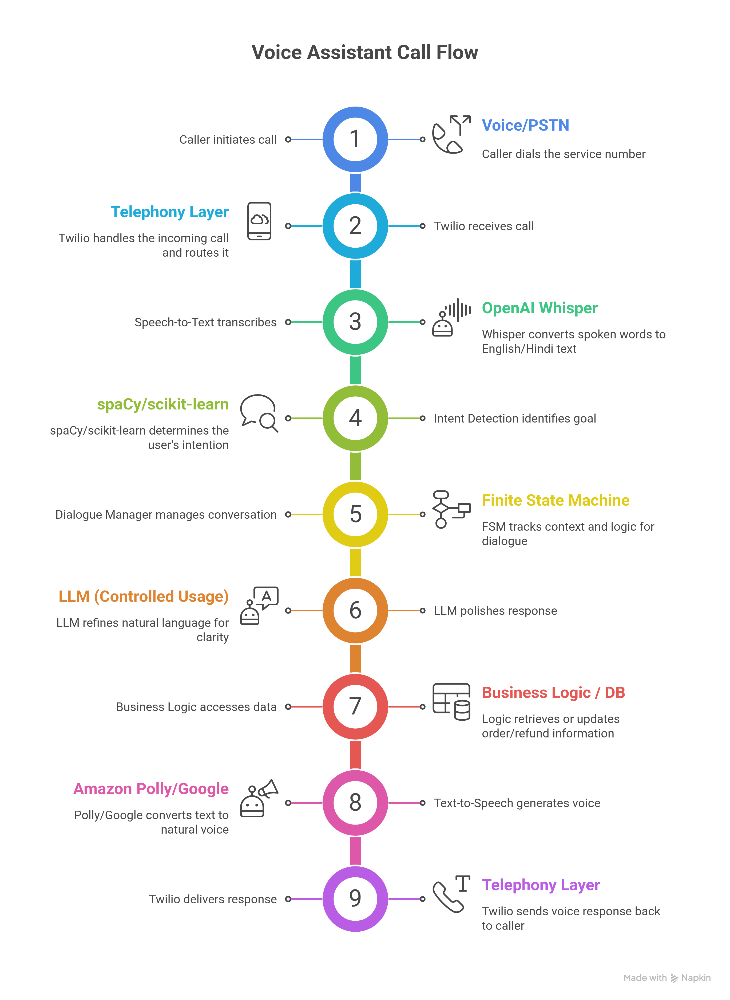

# PROJECT SYNOPSIS  
## Design and Development of an Intelligent Conversational Voice Agent for Customer Care Automation in Small and Midscale Indian Enterprises

---

## 1. Introduction

Customer care systems represent one of the most critical interfaces between an organization and its customers. In India, a significant proportion of customer interactions continue to occur through voice calls rather than chat or email. Despite advancements in digital platforms, many organizations still rely on traditional Interactive Voice Response (IVR) systems and largely manual call center operations.

Traditional IVR systems are menu driven and rigid in nature. Customers are required to listen to long option lists, press numeric keys multiple times, wait in queues, and often repeat the same issue to different agents. This frequently results in frustration, poor customer experience, and loss of trust. From an organizational perspective, customer support teams face high call volumes, agent fatigue, recurring training costs, and inconsistent service quality.

Industry studies suggest that a substantial proportion of customer care calls, often estimated between **70 and 80 percent**, are repetitive and rule based. Common examples include order status inquiries, refund tracking, payment confirmation, service activation, and appointment scheduling. Small and midscale Indian enterprises are particularly affected, as they often lack the financial capacity to deploy enterprise-grade contact center solutions while still facing increasing customer expectations.

---

## 2. Problem Statement

The existing customer care calling infrastructure suffers from several structural inefficiencies. Customers commonly experience long waiting times, confusing IVR menus, repeated explanations of their issues, and variability in responses from human agents. At the same time, organizations incur high operational costs, face low first-contact resolution rates, and deal with frequent agent turnover.

There is a noticeable gap in the availability of **affordable, intelligent, and language-aware voice automation solutions** that are specifically designed for small and midscale Indian enterprises. Many existing solutions are either too basic to be effective, too expensive for smaller organizations, or too complex to deploy and maintain within limited technical environments.

---

## 3. Objectives of the Project

The primary objective of this project is to design and develop an intelligent conversational voice agent that explores the feasibility of automating selected customer care calls as an alternative to traditional IVR systems.

The specific objectives are:
- Enable natural language voice interaction without rigid menu navigation  
- Identify customer intent using speech and language processing techniques  
- Handle a limited set of common customer queries without human agent involvement  
- Explore reduction in average call handling time for repetitive queries  
- Support English and Hindi languages in a basic but extensible manner  
- Design a modular, understandable, and secure system architecture  
- Implement a working prototype suitable for academic evaluation and further enhancement  

---

## 4. Scope of the Project

The scope of this minor project is limited to building a **functional prototype** that demonstrates the practicality of conversational voice automation for selected customer care scenarios.

The system focuses on a **single industry vertical**, such as e-commerce, and addresses three commonly occurring customer issues:
- Order status inquiry  
- Return initiation  
- Refund status  

The prototype supports real-time voice interaction, intent detection, multi-turn dialogue handling, and voice-based responses. Advanced enterprise features such as large-scale CRM integration, workforce management, billing systems, and compliance automation are considered outside the scope of this project.

---

## 5. Target Users and Market Relevance

The target users of the proposed system are **small and midscale Indian enterprises** operating in domains such as e-commerce, logistics, subscription-based services, healthcare clinics, and local service providers.

These organizations typically manage a high volume of repetitive customer queries while operating under constrained budgets and limited technical manpower. Industry observations indicate that customer support operations can consume a significant portion of operational expenditure, often ranging between **20 and 35 percent** for smaller businesses. Average customer waiting times during peak periods may range from **5 to 12 minutes**, contributing to dissatisfaction and customer churn.

---

## 6. Unique Selling Propositions (USPs)

The proposed system differentiates itself from typical academic projects and conventional IVR solutions through the following aspects:
- Replacement of menu-based IVR navigation with conversational voice interaction for selected use cases  
- Hybrid intelligence approach combining deterministic rules with carefully controlled use of Large Language Models  
- India-focused design considerations such as local accents, basic Hinglish handling, and regional language extensibility  
- Cost-conscious architectural choices suitable for small and midscale enterprises  
- Emphasis on transparent and explainable decision-making logic  
- End-to-end system design covering telephony, speech processing, dialogue management, and response generation  

---

## 7. Technology Stack (Primary)

The system is implemented using widely adopted and accessible technologies, selected primarily for prototyping, learning value, and ease of integration.

- Telephony: Asterisk or SIP with Softphone for controlled testing  
- Backend: Python with FastAPI  
- Speech-to-Text: Whisper (local deployment)  
- Intent Detection: spaCy and scikit-learn  
- Dialogue Manager: Custom finite state machine  
- Text-to-Speech: Coqui TTS  
- Database: SQLite or PostgreSQL  
- Frontend: Simple HTML or React (basic administrative interface)  
- Deployment: Localhost or free cloud tier  
- LLM: Optional and limited fallback usage only  

---

## 8. Use of Large Language Models

Large Language Models are used in a **restricted and supporting role** within the system.

LLMs may assist with:
- Interpreting paraphrased or ambiguous user inputs  
- Improving the fluency of system-generated responses  

LLMs do not execute business logic, access databases directly, or make autonomous decisions. This hybrid approach prioritizes predictability, explainability, and cost control, making the system suitable for academic experimentation and evaluation.

---

## 9. Project Starting Point and Development Approach

The project begins with **problem analysis and flow design rather than direct coding**. One industry vertical is selected, and a small set of high-frequency customer care problems is identified. Call flow diagrams are created manually before implementation.

Sample user utterances are collected to train and test the intent detection components. Development proceeds incrementally, starting with a basic end-to-end call loop and gradually adding language handling, dialogue management, and basic analytics.

---

## 10. System Design

### 10.1 Voice Assistant Call Flow and Architecture

The system follows a **modular and layered architecture**, where each component handles a specific stage of the customer care interaction. This design supports clarity, incremental development, and ease of modification.

**Call Flow Overview:**
1. The caller initiates a phone call through the public telephone network.  
2. The telephony layer receives and routes the call to the backend.  
3. The Speech-to-Text module converts spoken input into text.  
4. The intent detection module analyzes the text to infer the user’s intent.  
5. The dialogue manager maintains context and determines the next action.  
6. A Large Language Model may be used selectively to refine responses.  
7. Business logic retrieves or updates relevant data when required.  
8. The Text-to-Speech module generates spoken output.  
9. The response is delivered back to the caller through the telephony layer.  

---

## 11. Project Timeline

- **Month 1:** Problem analysis, telephony setup, speech-to-text integration, basic intent flow  
- **Month 2:** Intent classifier refinement, multi-turn dialogue handling, basic data integration  
- **Month 3:** Hindi language support, fallback handling, testing, documentation, and evaluation  

---

## 12. Expected Outcomes and Performance Metrics

The project aims to demonstrate the following indicative outcomes:
- Intent recognition accuracy in the range of **70 to 80 percent** for supported use cases  
- Noticeable reduction in call handling time for automated queries  
- Partial resolution of repetitive calls without agent escalation  
- End-to-end response latency maintained within acceptable limits for a prototype  
- Improved interaction experience for supported query types  

---

## 13. Risks and Mitigation Strategies

Potential risks include speech recognition inaccuracies, increased response latency, and variability in language model outputs. These risks are addressed through confidence thresholds, predefined fallback flows, restricted LLM usage, and testing with diverse sample inputs.

---

## 14. Conclusion

This project explores the application of conversational voice automation to selected customer care scenarios relevant to small and midscale Indian enterprises. By combining speech processing, hybrid artificial intelligence, and modular system design, the prototype demonstrates practical feasibility within an academic context. The work also establishes a foundation for future refinement and expansion, should the system be extended beyond the scope of this project.

---